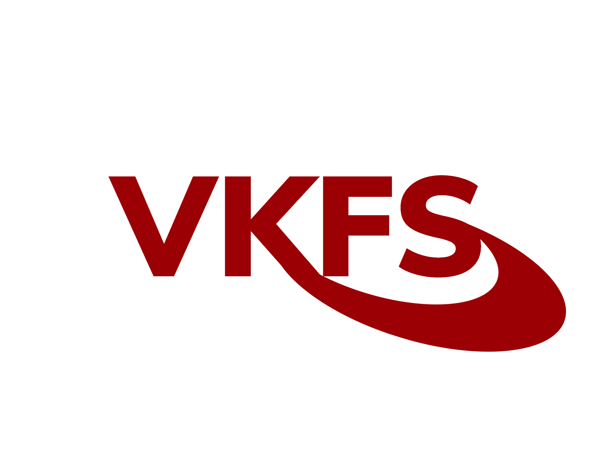

# VKFS - Vulkan Fast Setup Framework



## VKFS is a cross-platform C++ framework that allows you to quickly create basic Vulkan objects for further work, such as Instance, Physical Device, Device, Command queues, Command buffer and synchronization objects.

#### Note: The framework is currently under development and may contain bugs or some missing functionality.

## Tutorials:
- ["Hello Triangle" app](tutorials/VKFS-Hello-Triangle-Tutorial.md)
- [Using ImGui with VKFS](tutorials/VKFS-Imgui-Tutorial.md)

#### Note: These tutorials assume that you already have a working environment with a configured compiler and linked libraries.

## Brief description of objects:

### Instance:
The object that creates an Instance of your application.

Example:
```cpp
   auto instance = new VKFS::Instance("Application Name", "Engine name", [std::vector<const char*>: instanceExtensions], [bool: enableValidationLayers], [OPTIONAL uint32_t API_VERSION=VK_API_VERSION_1_2]);
```

### Device:
The object that picks up VkPhysicalDevice, creates VkDevice based on it, as well as command queues.

Example:
```cpp
   auto device = new VKFS::Device(instance, [std::vector<const char*>: deviceExtensions]);
```

### Swapchain
An object that creates a swap chain and renderpass for it.

Example:
```cpp
   auto swapchain = new VKFS::Swapchain(device, [int: windowWidth], [int: windowHeight]);
```

### Descriptor
The object that creates VkDescriptorSetLayout, VkDescriptorSet and everything necessary for this. Allows you to create a Descriptor for UBO, Sampler or Storage Buffer in just two lines.

Example:
```cpp
   auto descriptor = new VKFS::Descriptor(device, VK_DESCRIPTOR_TYPE_UNIFORM_BUFFER, [VkShaderStageFlagBits: shaderStage]);
   descriptor->createUBOSet(sizeof(YourUBOStructure));
```
OR

```cpp
   auto descriptor = new VKFS::Descriptor(device, VK_DESCRIPTOR_TYPE_COMBINED_IMAGE_SAMPLER, [VkShaderStageFlagBits: shaderStage]);
   descriptor->createSamplerSet([VkDescriptorImageInfo: imageInfo]);
```

### Shader Module
An object that allows you to conveniently load and create a VkShaderModule

Example:
```cpp
   auto vertex = new VKFS::ShaderModule(device, "path/to/spv");
```


### Vertex Buffer
This object allows you to create a buffer of vertices and indices using your vertex structure

Example:
```cpp
   auto vb = new VKFS::VertexBuffer<YourVertexStruct>(device, [std::vector<YourVertexStruct> vertices], [std::vector<uint32_t> indices]);
```

You can also use this with Push Constants:
```cpp
   auto vb = new VKFS::VertexBuffer<YourVertexStruct, YourPushConstantsStruct>(device, [std::vector<YourVertexStruct> vertices], [std::vector<uint32_t> indices]);
```
Next, before you draw, call
```cpp
   vb->pushPushConstants(yourPushConstants);
```


### Tested on
|Platform|Status |
|-------|:-: |
|Windows(MSYS2)| ✔️ |
|MacOS  | ✔️ |
|Linux(Debian 11)  | ✔️ |


### Building
To build a framework, use CMake:

```
git clone https://github.com/MHDtA-dev/VKFS.git
cd VKFS
mkdir build
cd build
cmake -DVULKAN_INCLUDE_PATH=[Vulkan SDK include path] ..
make
```
