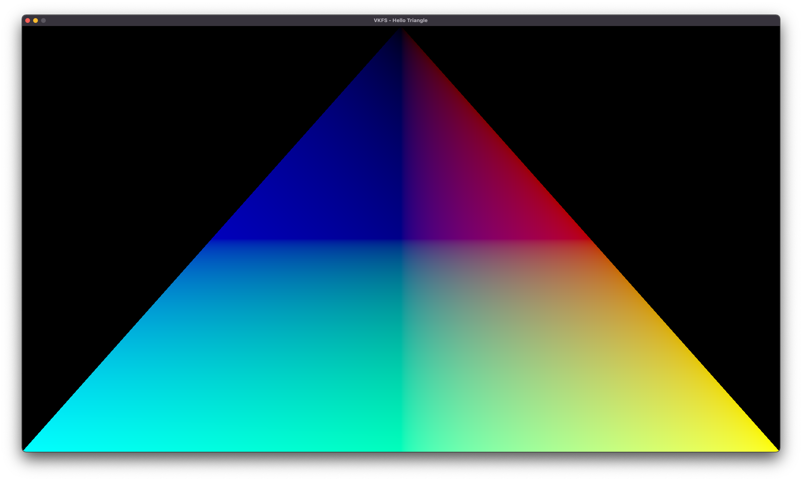

## VKFS - Hello Triangle App tutorial
In this tutorial, we will create a simple application that will display a colored triangle on the screen.



Required libraries:
- Vulkan v1.2
- VKFS v1.0
- SDL2 with Vulkan module
- GLM

### Step 1. Include all necessary libraries
```cpp
#include <iostream>

#include <SDL2/SDL.h>
#include <SDL2/SDL_vulkan.h>

#include <vulkan/vulkan.h>
#include <VKFS/VKFS.h>

#include <glm/glm.hpp>
#include <glm/gtc/matrix_transform.hpp>
```

### Step 2. Initialize SDL2
Note: Now we are working in int main()
```cpp
    SDL_Init(SDL_INIT_VIDEO); // Init video
    SDL_WindowFlags window_flags = (SDL_WindowFlags)(SDL_WINDOW_VULKAN); // Set window Vulkan flag
    
    SDL_Window* window = SDL_CreateWindow(
        "VKFS - Hello Triangle",
        SDL_WINDOWPOS_UNDEFINED,
        SDL_WINDOWPOS_UNDEFINED,
        1920,
        1080,
        window_flags
    );
    
    bool quit = false; // App close flag
    SDL_Event event;
```

### Step 3. Get instance extensions
```cpp
    uint32_t extensionCount = 0;
    SDL_Vulkan_GetInstanceExtensions(window, &extensionCount, nullptr);
    std::vector<const char *> extensions(extensionCount);

#ifdef __APPLE__ //If we are on macOS, we should use Vulkan Portability
    extensions.push_back("VK_KHR_portability_enumeration");
#endif

    extensions.push_back("VK_EXT_debug_utils");

```

### Step 4. Get device extensions
```cpp
    std::vector<const char *> deviceExts;
    deviceExts.push_back(VK_KHR_SWAPCHAIN_EXTENSION_NAME);
    
#ifdef __APPLE__ //If we are on macOS, we should use Vulkan Portability
    deviceExts.push_back("VK_KHR_portability_subset");
#endif
    
    SDL_Vulkan_GetInstanceExtensions(window, &extensionCount, extensions.data());

```


### Step 5. Create app instance
```cpp
    auto instance = new VKFS::Instance("Hello Triangle", "No Engine", extensions, true);
```

### Step 6. Create Vulkan surface and pass it to instance
```cpp
    VkSurfaceKHR s;
    SDL_Vulkan_CreateSurface(window, instance->getNative(), &s);
    instance->setSurface(s);
```

### Step 7. Create device
```cpp
    auto device = new VKFS::Device(instance, deviceExts);
```

### Step 8. Get window size and create swap chain
```cpp
    int windowWidth, windowHeight;
    SDL_GetWindowSize(window, &windowWidth, &windowHeight);

    auto swapchain = new VKFS::Swapchain(device, windowWidth, windowHeight);
```

### Step 9. Create command buffer and synchronization object
```cpp
    auto commandBuffer = new VKFS::CommandBuffer(device);
    auto sync = new VKFS::Synchronization(device, commandBuffer, swapchain);
```

### Step 10. Write vertex and fragment shaders and compile them

#### Vertex:
```glsl
#version 460

layout(location = 0) in vec3 inPosition;
layout(location = 0) out vec3 Position;

void main() {
    gl_Position = vec4(inPosition, 1);
    Position = inPosition;
}
```

#### Fragment:
```glsl
#version 460

layout(location = 0) in vec3 Position;
layout(location = 0) out vec4 FragColor;

void main() {
    FragColor = vec4(Position, 1);
}
```

### Step 11. Load shaders
```cpp
    auto vertex = new VKFS::ShaderModule(device, "vertex.spv");
    auto fragment = new VKFS::ShaderModule(device, "fragment.spv");
```

### Step 12. Declare Pipeline struct
```cpp
struct Pipeline {
    VkPipeline pipeline;
    VkPipelineLayout pipelineLayout;
};
```

### Step 13. Declare Vertex struct
```cpp
    struct Vertex {
        glm::vec3 pos;
    
        static VkVertexInputBindingDescription getBindingDescription() {
            VkVertexInputBindingDescription bindingDescription{};
            bindingDescription.binding = 0;
            bindingDescription.stride = sizeof(Vertex);
            bindingDescription.inputRate = VK_VERTEX_INPUT_RATE_VERTEX;
    
            return bindingDescription;
        }
    
        static std::array<VkVertexInputAttributeDescription, 1> getAttributeDescriptions() {
            std::array<VkVertexInputAttributeDescription, 1> attributeDescriptions{};
    
            attributeDescriptions[0].binding = 0;
            attributeDescriptions[0].location = 0;
            attributeDescriptions[0].format = VK_FORMAT_R32G32B32_SFLOAT;
            attributeDescriptions[0].offset = offsetof(Vertex, pos);
    
            return attributeDescriptions;
        }
    
    };
```

### Step 14. Write a function to create a pipeline
```cpp
Pipeline createPipeline(VkShaderModule vertex, VkShaderModule fragment, VkRenderPass renderpass, VkDevice device) {

    Pipeline p;

    VkPipelineShaderStageCreateInfo vertShaderStageInfo{};
    vertShaderStageInfo.sType = VK_STRUCTURE_TYPE_PIPELINE_SHADER_STAGE_CREATE_INFO;
    vertShaderStageInfo.stage = VK_SHADER_STAGE_VERTEX_BIT;
    vertShaderStageInfo.module = vertex;
    vertShaderStageInfo.pName = "main";

    VkPipelineShaderStageCreateInfo fragShaderStageInfo{};
    fragShaderStageInfo.sType = VK_STRUCTURE_TYPE_PIPELINE_SHADER_STAGE_CREATE_INFO;
    fragShaderStageInfo.stage = VK_SHADER_STAGE_FRAGMENT_BIT;
    fragShaderStageInfo.module = fragment;
    fragShaderStageInfo.pName = "main";

    VkPipelineShaderStageCreateInfo shaderStages[] = {vertShaderStageInfo, fragShaderStageInfo};

    VkPipelineVertexInputStateCreateInfo vertexInputInfo{};
    vertexInputInfo.sType = VK_STRUCTURE_TYPE_PIPELINE_VERTEX_INPUT_STATE_CREATE_INFO;

    auto bindingDescription = Vertex::getBindingDescription();
    auto attributeDescriptions = Vertex::getAttributeDescriptions();

    vertexInputInfo.vertexBindingDescriptionCount = 1;
    vertexInputInfo.vertexAttributeDescriptionCount = static_cast<uint32_t>(attributeDescriptions.size());
    vertexInputInfo.pVertexBindingDescriptions = &bindingDescription;
    vertexInputInfo.pVertexAttributeDescriptions = attributeDescriptions.data();

    VkPipelineInputAssemblyStateCreateInfo inputAssembly{};
    inputAssembly.sType = VK_STRUCTURE_TYPE_PIPELINE_INPUT_ASSEMBLY_STATE_CREATE_INFO;
    inputAssembly.topology = VK_PRIMITIVE_TOPOLOGY_TRIANGLE_LIST;
    inputAssembly.primitiveRestartEnable = VK_FALSE;

    VkPipelineViewportStateCreateInfo viewportState{};
    viewportState.sType = VK_STRUCTURE_TYPE_PIPELINE_VIEWPORT_STATE_CREATE_INFO;
    viewportState.viewportCount = 1;
    viewportState.scissorCount = 1;

    VkPipelineRasterizationStateCreateInfo rasterizer{};
    rasterizer.sType = VK_STRUCTURE_TYPE_PIPELINE_RASTERIZATION_STATE_CREATE_INFO;
    rasterizer.depthClampEnable = VK_FALSE;
    rasterizer.rasterizerDiscardEnable = VK_FALSE;
    rasterizer.polygonMode = VK_POLYGON_MODE_FILL;
    rasterizer.lineWidth = 1.0f;
    rasterizer.cullMode = VK_CULL_MODE_NONE;
    rasterizer.frontFace = VK_FRONT_FACE_COUNTER_CLOCKWISE;
    rasterizer.depthBiasEnable = VK_FALSE;

    VkPipelineMultisampleStateCreateInfo multisampling{};
    multisampling.sType = VK_STRUCTURE_TYPE_PIPELINE_MULTISAMPLE_STATE_CREATE_INFO;
    multisampling.sampleShadingEnable = VK_FALSE;
    multisampling.rasterizationSamples = VK_SAMPLE_COUNT_1_BIT;

    VkPipelineDepthStencilStateCreateInfo depthStencil{};
    depthStencil.sType = VK_STRUCTURE_TYPE_PIPELINE_DEPTH_STENCIL_STATE_CREATE_INFO;
    depthStencil.depthTestEnable = VK_TRUE;
    depthStencil.depthWriteEnable = VK_TRUE;
    depthStencil.depthCompareOp = VK_COMPARE_OP_LESS;
    depthStencil.depthBoundsTestEnable = VK_FALSE;
    depthStencil.stencilTestEnable = VK_FALSE;

    VkPipelineColorBlendAttachmentState colorBlendAttachment{};
    colorBlendAttachment.colorWriteMask = VK_COLOR_COMPONENT_R_BIT | VK_COLOR_COMPONENT_G_BIT | VK_COLOR_COMPONENT_B_BIT | VK_COLOR_COMPONENT_A_BIT;
    colorBlendAttachment.blendEnable = VK_FALSE;

    VkPipelineColorBlendStateCreateInfo colorBlending{};
    colorBlending.sType = VK_STRUCTURE_TYPE_PIPELINE_COLOR_BLEND_STATE_CREATE_INFO;
    colorBlending.logicOpEnable = VK_FALSE;
    colorBlending.logicOp = VK_LOGIC_OP_COPY;
    colorBlending.attachmentCount = 1;
    colorBlending.pAttachments = &colorBlendAttachment;
    colorBlending.blendConstants[0] = 0.0f;
    colorBlending.blendConstants[1] = 0.0f;
    colorBlending.blendConstants[2] = 0.0f;
    colorBlending.blendConstants[3] = 0.0f;

    std::vector<VkDynamicState> dynamicStates = {
            VK_DYNAMIC_STATE_VIEWPORT,
            VK_DYNAMIC_STATE_SCISSOR
    };
    VkPipelineDynamicStateCreateInfo dynamicState{};
    dynamicState.sType = VK_STRUCTURE_TYPE_PIPELINE_DYNAMIC_STATE_CREATE_INFO;
    dynamicState.dynamicStateCount = static_cast<uint32_t>(dynamicStates.size());
    dynamicState.pDynamicStates = dynamicStates.data();

    VkPipelineLayoutCreateInfo pipelineLayoutInfo{};
    pipelineLayoutInfo.sType = VK_STRUCTURE_TYPE_PIPELINE_LAYOUT_CREATE_INFO;
    pipelineLayoutInfo.setLayoutCount = 0;

    if (vkCreatePipelineLayout(device, &pipelineLayoutInfo, nullptr, &p.pipelineLayout) != VK_SUCCESS) {
        throw std::runtime_error("Failed to create pipeline layout!");
    }

    VkGraphicsPipelineCreateInfo pipelineInfo{};
    pipelineInfo.sType = VK_STRUCTURE_TYPE_GRAPHICS_PIPELINE_CREATE_INFO;
    pipelineInfo.stageCount = 2;
    pipelineInfo.pStages = shaderStages;
    pipelineInfo.pVertexInputState = &vertexInputInfo;
    pipelineInfo.pInputAssemblyState = &inputAssembly;
    pipelineInfo.pViewportState = &viewportState;
    pipelineInfo.pRasterizationState = &rasterizer;
    pipelineInfo.pMultisampleState = &multisampling;
    pipelineInfo.pDepthStencilState = &depthStencil;
    pipelineInfo.pColorBlendState = &colorBlending;
    pipelineInfo.pDynamicState = &dynamicState;
    pipelineInfo.layout = p.pipelineLayout;
    pipelineInfo.renderPass = renderpass;
    pipelineInfo.subpass = 0;
    pipelineInfo.basePipelineHandle = VK_NULL_HANDLE;

    if (vkCreateGraphicsPipelines(device, VK_NULL_HANDLE, 1, &pipelineInfo, nullptr, &p.pipeline) != VK_SUCCESS) {
        throw std::runtime_error("Failed to create pipeline!");
    }

    return p;
}
```

### Step 15. Create pipeline
```cpp
    Pipeline p = createPipeline(vertex->getShaderModule(), fragment->getShaderModule(), swapchain->getRenderPass(), device->getDevice());
```

### Step 16. Create vertices and indices vectors
```cpp
    std::vector<Vertex> vertices = {
                {{0.f, -1.f, 0.f}},
                {{1.f, 1.f, 0.f}},
                {{-1.f, 1.f, 1.f}}
    };
    
    std::vector<uint32_t> indices = {0, 1, 2};
```

### Step 17. Create Vertex buffer
```cpp
    auto VB = new VKFS::VertexBuffer<Vertex>(device, vertices, indices);
```


### Step 18. Finally, create main loop
```cpp
    while (!quit) {
        while (SDL_PollEvent(&event) != 0) { // Getting events
            if (event.type == SDL_QUIT) {
                quit = true;
            }
        }

        SDL_GetWindowSize(window, &windowWidth, &windowHeight);
        sync->pushWindowSize(windowWidth, windowHeight); // Pass window size to sync object every frame
        
        uint32_t imageIndex = VKFS::prepareFrame(sync); // Getting image index
        VKFS::begin(sync); // Beginning rendering
        
        // Beginning render pass
        VkRenderPassBeginInfo renderPassInfo{};
        renderPassInfo.sType = VK_STRUCTURE_TYPE_RENDER_PASS_BEGIN_INFO;
        renderPassInfo.renderPass = swapchain->getRenderPass();
        renderPassInfo.framebuffer = swapchain->getFramebuffer(imageIndex);
        renderPassInfo.renderArea.offset = {0, 0};
        renderPassInfo.renderArea.extent = swapchain->getExtent();
        
        std::array<VkClearValue, 2> clearValues{};
        clearValues[0].color = {{0.0f, 0.0f, 0.0f, 1.0f}};
        clearValues[1].depthStencil = {1.0f, 0};
        
        renderPassInfo.clearValueCount = static_cast<uint32_t>(clearValues.size());
        renderPassInfo.pClearValues = clearValues.data();
        
        vkCmdBeginRenderPass(sync->getCommandBuffer(), &renderPassInfo, VK_SUBPASS_CONTENTS_INLINE);

        VB->draw(sync, p.pipelineLayout, p.pipeline, swapchain->getExtent()); // Drawing

        // Finishing rendering
        vkCmdEndRenderPass(sync->getCommandBuffer());
        VKFS::end(sync, imageIndex);
    }
```

#### And as a result, you should have something like this:

