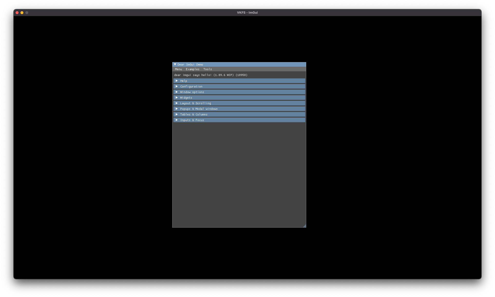

## VKFS - ImGui tutorial

In this tutorial we will learn how to use Dear ImGui together with VKFS



Required libraries:
- Vulkan v1.2
- VKFS v1.0
- SDL2 with Vulkan module
- Dear ImGui with Vulkan and SDL2 implementations

### Step 1. Include all necessary libraries
```cpp
#include <iostream>

#include <VKFS/VKFS.h>

#include <SDL2/SDL.h>
#include <SDL2/SDL_vulkan.h>

#include "imgui/imgui.h"
#include "imgui/imgui_impl_sdl2.h"
#include "imgui/imgui_impl_vulkan.h"
```

### Step 2. Initialize SDL2
```cpp
    SDL_Init(SDL_INIT_VIDEO); // Init video
    SDL_WindowFlags window_flags = (SDL_WindowFlags)(SDL_WINDOW_VULKAN); // Set window Vulkan flag
    
    SDL_Window* window = SDL_CreateWindow(
        "VKFS - ImGui",
        SDL_WINDOWPOS_UNDEFINED,
        SDL_WINDOWPOS_UNDEFINED,
        1920,
        1080,
        window_flags
    );
    
    bool quit = false; // App close flag
    SDL_Event event;
```

### Step 3. Get instance extensions
```cpp
    uint32_t extensionCount = 0;
    SDL_Vulkan_GetInstanceExtensions(window, &extensionCount, nullptr);
    std::vector<const char *> extensions(extensionCount);

#ifdef __APPLE__ //If we are on macOS, we should use Vulkan Portability
    extensions.push_back("VK_KHR_portability_enumeration");
#endif

    extensions.push_back("VK_EXT_debug_utils");
```

### Step 4. Get device extensions
```cpp
    std::vector<const char *> deviceExts;
    deviceExts.push_back(VK_KHR_SWAPCHAIN_EXTENSION_NAME);
    
#ifdef __APPLE__ //If we are on macOS, we should use Vulkan Portability
    deviceExts.push_back("VK_KHR_portability_subset");
#endif
    
    SDL_Vulkan_GetInstanceExtensions(window, &extensionCount, extensions.data());

```

### Step 5. Create app instance
```cpp
    auto instance = new VKFS::Instance("ImGui VKFS app", "No Engine", extensions, true);
```

### Step 6. Create Vulkan surface and pass it to instance
```cpp
    VkSurfaceKHR s;
    SDL_Vulkan_CreateSurface(window, instance->getNative(), &s);
    instance->setSurface(s);
```

### Step 7. Create device
```cpp
    auto device = new VKFS::Device(instance, deviceExts);
```

### Step 8. Get window size and create swap chain
```cpp
    int windowWidth, windowHeight;
    SDL_GetWindowSize(window, &windowWidth, &windowHeight);

    auto swapchain = new VKFS::Swapchain(device, windowWidth, windowHeight);
```

### Step 9. Create command buffer and synchronization object
```cpp
    auto commandBuffer = new VKFS::CommandBuffer(device);
    auto sync = new VKFS::Synchronization(device, commandBuffer, swapchain);
```

### Step 10. Create descriptor pool for ImGui
```cpp
    VkDescriptorPoolSize pool_sizes[] =
            {
                    { VK_DESCRIPTOR_TYPE_SAMPLER, 1000 },
                    { VK_DESCRIPTOR_TYPE_COMBINED_IMAGE_SAMPLER, 1000 },
                    { VK_DESCRIPTOR_TYPE_SAMPLED_IMAGE, 1000 },
                    { VK_DESCRIPTOR_TYPE_STORAGE_IMAGE, 1000 },
                    { VK_DESCRIPTOR_TYPE_UNIFORM_TEXEL_BUFFER, 1000 },
                    { VK_DESCRIPTOR_TYPE_STORAGE_TEXEL_BUFFER, 1000 },
                    { VK_DESCRIPTOR_TYPE_UNIFORM_BUFFER, 1000 },
                    { VK_DESCRIPTOR_TYPE_STORAGE_BUFFER, 1000 },
                    { VK_DESCRIPTOR_TYPE_UNIFORM_BUFFER_DYNAMIC, 1000 },
                    { VK_DESCRIPTOR_TYPE_STORAGE_BUFFER_DYNAMIC, 1000 },
                    { VK_DESCRIPTOR_TYPE_INPUT_ATTACHMENT, 1000 }
            };

    VkDescriptorPoolCreateInfo pool_info = {};
    pool_info.sType = VK_STRUCTURE_TYPE_DESCRIPTOR_POOL_CREATE_INFO;
    pool_info.flags = VK_DESCRIPTOR_POOL_CREATE_FREE_DESCRIPTOR_SET_BIT;
    pool_info.maxSets = 1000;
    pool_info.poolSizeCount = std::size(pool_sizes);
    pool_info.pPoolSizes = pool_sizes;

    VkDescriptorPool imguiPool;
    vkCreateDescriptorPool(device->getDevice(), &pool_info, nullptr, &imguiPool);
```

### Step 11. Initialize ImGui
```cpp
    ImGui::CreateContext();
    ImGui_ImplSDL2_InitForVulkan(window);
    
    ImGui_ImplVulkan_InitInfo init_info = {};
    init_info.Instance = instance->getNative();
    init_info.PhysicalDevice = device->getPhysicalDevice();
    init_info.Device = device->getDevice();
    init_info.Queue = device->getGraphicsQueue();
    init_info.DescriptorPool = imguiPool;
    init_info.MinImageCount = 3;
    init_info.ImageCount = 3;
    init_info.MSAASamples = VK_SAMPLE_COUNT_1_BIT;

    ImGui_ImplVulkan_Init(&init_info, swapchain->getRenderPass());

    VkCommandBuffer temp = device->beginSingleTimeCommands();
    ImGui_ImplVulkan_CreateFontsTexture(temp);

    device->endSingleTimeCommands(temp);

    ImGui_ImplVulkan_DestroyFontUploadObjects();

```

### Step 12. Finally, create main loop
```cpp
    while (!quit) {
        while (SDL_PollEvent(&event) != 0) { // Getting events
            ImGui_ImplSDL2_ProcessEvent(&event); // Passing events to ImGui
            if (event.type == SDL_QUIT) {
                quit = true;
            }
        }

        uint32_t imageIndex = VKFS::prepareFrame(sync); // Getting image index
        VKFS::begin(sync); // Beginning rendering

        // Beginning render pass
        VkRenderPassBeginInfo renderPassInfo{};
        renderPassInfo.sType = VK_STRUCTURE_TYPE_RENDER_PASS_BEGIN_INFO;
        renderPassInfo.renderPass = swapchain->getRenderPass();
        renderPassInfo.framebuffer = swapchain->getFramebuffer(imageIndex);
        renderPassInfo.renderArea.offset = {0, 0};
        renderPassInfo.renderArea.extent = swapchain->getExtent();

        std::array<VkClearValue, 2> clearValues{};
        clearValues[0].color = {{0.0f, 0.0f, 0.0f, 1.0f}};
        clearValues[1].depthStencil = {1.0f, 0};

        renderPassInfo.clearValueCount = static_cast<uint32_t>(clearValues.size());
        renderPassInfo.pClearValues = clearValues.data();

        vkCmdBeginRenderPass(sync->getCommandBuffer(), &renderPassInfo, VK_SUBPASS_CONTENTS_INLINE);
        
        // Beginning ImGui rendering
        ImGui_ImplVulkan_NewFrame();
        ImGui_ImplSDL2_NewFrame(window);
        ImGui::NewFrame();

        // Draw anything you want here
        ImGui::ShowDemoWindow();

        // Finishing ImGui rendering
        ImGui::Render();
        ImGui_ImplVulkan_RenderDrawData(ImGui::GetDrawData(), sync->getCommandBuffer());
        
        // Finishing rendering.
        vkCmdEndRenderPass(sync->getCommandBuffer());
        VKFS::end(sync, imageIndex);
    }

```

#### And as a result, you should have something like this:

